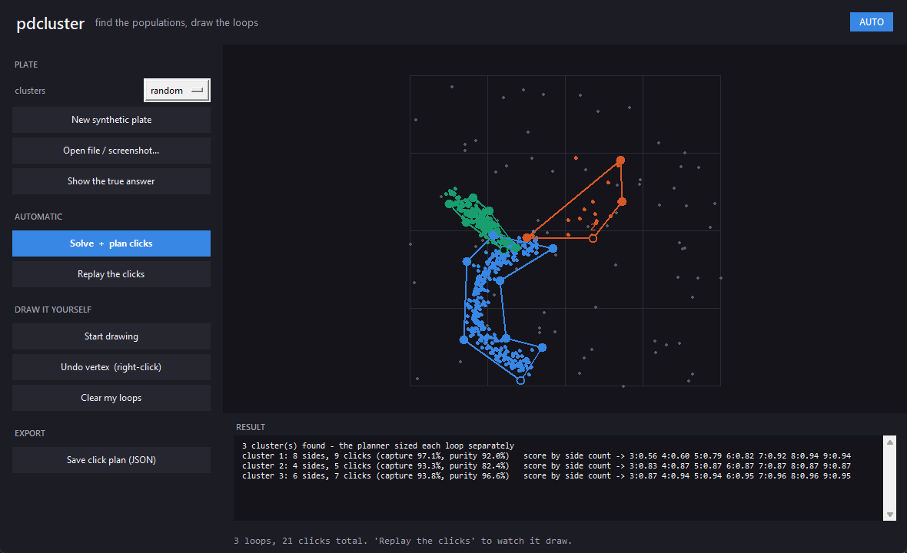

# eve-cluster-recognition

Cluster recognition for **Project Discovery**-style scatter plates, in pure Python.

EVE Online's Project Discovery (the COVID-19 / flow-cytometry phase) shows you a
2D scatter plot and asks you to draw a loop around each population of cells. This
project does that job automatically: it finds the clusters, decides how many there
are, draws the outlines, and **remembers every plate it solved perfectly** so that
a repeat of the same plate is answered instantly instead of being searched again.

```
plate ──▶ memory lookup ───────── hit ──▶ reuse the stored, perfect answer
             │
            miss
             ▼
     candidate sweep ─▶ features ─▶ ML ranker ─▶ best labels ─▶ polygons
                                                      │
                                    graded perfect? ──┴──▶ written to memory
```

---

## Why it is built this way

**No single clustering algorithm wins on every plate.** K-means is excellent on
round, well-separated blobs and shreds elongated ones. DBSCAN and HDBSCAN handle
crescents, comet tails and background debris but are very sensitive to their
density parameters. A Gaussian mixture is ideal for overlapping ellipses.

So the hard problem is not "run a clustering algorithm" — it is **choosing which
answer to submit**. That choice is what the machine learning does here:

1. **Sweep** ~40 candidate clusterings per plate (k-means, GMM, agglomerative,
   DBSCAN, HDBSCAN across a parameter grid, plus the "there is nothing here"
   answer, which is a legitimate response).
2. **Describe** each candidate with 18 features that need no ground truth —
   silhouette / Calinski-Harabasz / Davies-Bouldin, cluster balance, density
   contrast, how Gaussian each cluster is, boundary sharpness, the Hopkins
   statistic, and a **stability probe** that re-clusters 80% subsamples and
   measures whether the same answer comes back.
3. **Rank** them with a gradient-boosted regressor trained to predict the grade
   each candidate would actually receive.
4. **Submit** the best one, and store it if it scored perfectly.

Training data is free: the synthetic generator knows the right answer, so every
candidate can be graded and used as a training row.

---

## Installation

```bash
git clone https://github.com/DemianDomanskyy/eve-cluster-recognition.git
cd eve-cluster-recognition
python -m venv .venv
source .venv/bin/activate        # Windows: .venv\Scripts\activate
pip install -e ".[dev]"
```

Python 3.10+. Dependencies: numpy, scipy, scikit-learn, joblib, pillow, matplotlib.

## Quick start

```bash
# the desktop app - solve plates, or draw the loops yourself
pdcluster gui

# see everything working in the terminal, no training required
python scripts/demo.py --out out/

# train the ranker on synthetic plates, then grade it on unseen ones
pdcluster synth --out data/train --plates 140 --seed 1
pdcluster train --dataset data/train --model models/ranker.joblib
pdcluster eval  --dataset data/test  --model models/ranker.joblib --repeat

# solve one plate - a data file or a screenshot of the plot
pdcluster solve --input plate.csv       --model models/ranker.joblib --plot out.png
pdcluster solve --input screenshot.png  --model models/ranker.joblib --out answer.json
```

As a library:

```python
from pdcluster import ClusterRecognizer, load_plate

recognizer = ClusterRecognizer.from_paths(model_path="models/ranker.joblib")
result = recognizer.solve(load_plate("screenshot.png"))

print(result.solution.n_clusters)        # how many populations
print(result.solution.polygons)          # one outline per cluster, ready to draw
print(result.solution.source)            # "search" or "memory"
```

---

## Measured results

Trained on 140 synthetic plates, graded on **60 held-out plates** the model never
saw (`data/test`, seed 777). Roughly 45 candidate clusterings are generated and
scored per plate.

| Ranker | Mean score | Perfect | Cluster count correct |
|---|---|---|---|
| Heuristic (untrained fallback) | 0.626 | 1.7% | 41.7% |
| **Trained ranker** | **0.784** | **8.3%** | **61.7%** |
| *Oracle (best candidate in the pool)* | *0.880* | *18.3%* | *86.7%* |

Learning to choose the candidate is worth **+0.16 mean score**, a 5x higher
perfect rate, and +20 points of cluster-count accuracy — with an identical
candidate pool. The ranker itself predicts a candidate's grade with a test MAE of
**0.079**, against 0.294 for predicting the mean.

The **oracle** row is the ceiling: the best candidate the sweep produced, chosen
with the answer key in hand. It is the most useful number here, because it splits
the remaining error into two very different problems:

* The trained ranker captures **62% of the gap** between the heuristic and the
  oracle (+0.158 of an available 0.254). About **0.096 of ranking headroom is
  left** — a better ranker is still worth building.
* But the oracle itself is only **18.3% perfect**. On four plates out of five,
  *no candidate in the pool is exactly right*, so no amount of better ranking can
  fix them. Raising the perfect rate much further is a candidate-generation
  problem — a denser parameter grid, per-cluster refinement, or merging clusters
  across candidates — not a ranking problem.

Run `python scripts/benchmark.py` to reproduce that three-way split.

Which algorithm actually wins varies a lot by plate, which is the whole argument
for the sweep: across the 60 test plates the winner was DBSCAN 37 times, HDBSCAN
11, GMM 6, k-means 3, agglomerative 2, and "no clusters here" once.

**Read these numbers honestly.** These are deliberately nasty synthetic plates —
up to 5 populations, up to ~55% background debris, and crescent/comet shapes that
overlap. "Perfect" is a strict bar: the exact cluster count *and* ≥0.97 overlap on
every single cluster. A mean score of 0.78 means most plates are outlined close to
correctly; an 8.3% perfect rate means few are pixel-exact first time. Easy,
well-separated plates are solved exactly and routinely (see the test suite).

Because only perfect answers are stored, the memory's recall rate on *novel*
plates is bounded by that perfect rate — the second pass over the same 60 plates
recalled 5 of them. Memory pays off where the workload actually repeats, or where
you confirm answers yourself with `teach()`, after which recall is immediate:

```
[1] cold solve       7876 ms   search, 45 candidates considered
[3] warm solve        393 ms   recalled from memory  (20x faster)
[4] jittered copy               recalled, fingerprint similarity 0.9972
```

Reproduce it all with:

```bash
pdcluster eval --dataset data/test --model models/ranker.joblib --repeat
python scripts/benchmark.py --dataset data/test --model models/ranker.joblib
python scripts/demo.py --out out/
```

---

## The app

```bash
pdcluster gui
```



No arguments needed. It picks up `models/ranker.joblib` if you have trained one
and falls back to the heuristic ranker if you have not, so it runs on a fresh
clone. Two ways to work:

**Automatic** — *Solve + plan clicks* finds the populations, works out how many
sides each loop needs, and *Replay the clicks* animates it placing the vertices
one at a time, closing each loop on its own first vertex. The solve runs on a
worker thread, so the window stays live and tells you what it is doing instead
of freezing for the few seconds it takes.

**Draw it yourself** — *Start drawing* gives you the real mechanic:

* every click drops a vertex, and an edge joins it to the one before;
* **nine sides maximum** — past that the only legal click is the closing one;
* **click the first vertex again to close the loop** (it grows a green ring once
  you have three vertices, showing you it is ready to close);
* right-click undoes the last vertex.

The moment you close a loop it is scored against the plate — which cluster it
best matches, how much of that cluster it captured, how much of what it enclosed
was foreign — and compared to what the planner chose. *Show the true answer*
flips the point colours between the reference answer and what the solver found,
so you can see where it went wrong.

*Save click plan (JSON)* writes out every loop, planned and hand-drawn, as an
ordered list of click coordinates.

### Correcting it once is permanent

When the solver gets a plate wrong, draw the loops yourself and press
**Remember my loops**. Your loops become the plate's stored answer — the memory
only ever holds answers known to be correct, and one drawn by hand is exactly
that — so solving that plate again recalls it instead of searching, and a
resampled or jittered copy of it is recognised too:

```
1 cluster(s) via kmeans [search]        <- wrong, it merged everything
   ... you draw three loops and press Remember my loops
3 cluster(s) via taught [memory]        <- 0.8s, and correct from now on
```

This is the loop that makes the tool improve with use rather than making the
same mistake forever.

### Deciding how many sides a loop needs

A nine-vertex cap means a 300-vertex alpha shape has to be reduced to a handful
of corners, and the right number is not fixed — it depends on the shape. Each
budget from 3 to 9 is tried and scored on what it actually achieves:

* **capture** — the share of the cluster's own points that end up inside the loop
* **purity** — the share of points inside the loop that belong to the cluster,
  so enclosing a neighbouring population or a field of debris costs you

The two combine as an F1 score, and the winner is the **fewest** vertices that
comes within 1% of the best score any budget reached. Two more clicks for a 0.2%
better outline is not worth it; two more for 15% is. On the plate in the
screenshot that produces three different answers:

```
cluster 1: 8 sides   3:0.56  4:0.60  5:0.79  6:0.82  7:0.92  8:0.94  9:0.94
cluster 2: 4 sides   3:0.83  4:0.87  5:0.87  6:0.87  7:0.87  8:0.87  9:0.87
cluster 3: 6 sides   3:0.87  4:0.94  5:0.94  6:0.95  7:0.96  8:0.96  9:0.95
```

The long curved population earns all eight of its sides; the compact one plateaus
at four and the rest would be wasted clicks.

Two details that matter for a loop you could actually draw. Vertices are grown
outward along each **edge's own normal** rather than away from the centroid — a
crescent's centroid lies outside the crescent, so radial growth shears the shape
and swallows whatever sits in the bend. And every vertex is clamped inside the
plot area, because a click outside the plot is not a click you can make.

From the command line:

```bash
pdcluster solve --input plate.npz --clicks clicks.json --max-vertices 9
```


---

## The memory

This is the part that makes the system improve with use. Every solution graded
**perfect** is written to a SQLite store, keyed by a density fingerprint of the
point cloud, and recalled two ways:

| Path | When it fires | How the labels come back |
|---|---|---|
| **exact** | the coordinates hash to a stored key | reused verbatim |
| **similar** | the fingerprint is within `min_similarity` (default 0.985) — the same sample resampled or jittered | transferred by nearest neighbour from the remembered cloud |

A recalled answer is never trusted blindly: after a similarity transfer, the
result is rejected and the normal search runs if the transfer failed to reproduce
the remembered cluster count. Only perfect solutions are stored by default
(`store_only_perfect=True`), which is what makes a hit safe to return unexamined.

You can seed it from the app with **Remember my loops**, or in code with
`recognizer.teach(plate, labels)`.

```bash
pdcluster memory stats          # entries, recall count, breakdown by algorithm
pdcluster memory list --limit 10
pdcluster memory forget --id 42
```

The fingerprint is a 16x16 square-root density histogram, L2-normalized and
compared by cosine similarity — coarse enough to survive resampling and jitter,
specific enough that unrelated plates do not collide. It is invariant to
translation and scale, so the same population pattern is recognised even if the
axes are rescaled.

You can also seed the memory by hand with an answer you know is right:

```python
recognizer.teach(plate, labels)   # stored as a perfect solution
```

---

## Reading a plate from a screenshot

Project Discovery runs inside the game client, so the plate is usually pixels on
screen. `pdcluster.vision` thresholds the image (Otsu), finds connected blobs,
discards gridlines/axes/text by area and aspect ratio, and splits fused markers
into the right number of points by area:

```python
from pdcluster import points_from_image

plate = points_from_image("screenshot.png", crop=(120, 80, 980, 940))
```

Pass `crop` as the pixel box of the plot area to exclude axes and labels. On a
clean render this recovers every marker to within a fraction of a percent of its
true position (verified in the test suite).

---

## Scoring

Submissions are graded the way the in-game task is: clusters are matched
one-to-one to the reference by **optimal assignment on Jaccard overlap**
(Hungarian algorithm), so arbitrary cluster numbering is not punished, and the
score is penalised for each invented or missed cluster. A result counts as
**perfect** only when the cluster count is exactly right and every matched
cluster overlaps its reference by ≥ 0.97.

```python
from pdcluster import score_clustering
report = score_clustering(true_labels, predicted_labels)
print(report.summary(), report.is_perfect)
```

---

## Outlines

The submitted shape is an **alpha shape** (concave hull), not a convex hull: on a
crescent-shaped population a convex hull can be eight times too large, and all
that extra empty space is room for foreign points to fall inside your loop. The
outline is picked by an explicit trade-off — *the smallest-area shape that still
contains the cluster* — by walking the alpha family from tight to loose and
keeping the tightest one that holds ≥ 97% of the points. The convex hull stays in
the running as the last resort, since it contains everything by construction.

---

## Project layout

| File | Role |
|---|---|
| `types.py` | `Plate`, `Candidate`, `Solution` |
| `synth.py` | synthetic plates: gaussian, elongated, comet, crescent, dense-core |
| `candidates.py` | the algorithm/parameter sweep |
| `features.py` | the 18 ground-truth-free features, incl. the stability probe |
| `ranker.py` | the gradient-boosted ranker + heuristic cold-start fallback |
| `scoring.py` | Hungarian-matched grading and the definition of "perfect" |
| `memory.py` | the SQLite store of perfect solutions and its recall paths |
| `polygons.py` | alpha shapes, containment tests, outline padding |
| `vision.py` | screenshot → point cloud |
| `pipeline.py` | `ClusterRecognizer`, the end-to-end flow |
| `plotting.py` | figures (colorblind-validated palette) and the table view |
| `clicks.py` | reducing an outline to <=9 clickable vertices, and scoring the result |
| `gui.py` | the desktop app: auto-solve, click replay, and drawing by hand |
| `cli.py` | the `pdcluster` command |

## Tests

```bash
pytest -q
```

The suite covers grading (including the "a relabelling is not a mistake" and
"a near miss is not perfect" cases), every memory path, the candidate sweep, the
alpha-shape geometry, the screenshot round trip, and the end-to-end pipeline
including the cold→warm memory transition.

## Notes and limits

- The ranker is trained on **synthetic** plates. They are modelled on
  flow-cytometry shapes, but real in-game plates will differ; retrain on real
  labelled plates (`pdcluster train --dataset your_data/`) for best results.
- `max_k` defaults to 6 populations per plate.
- Feature extraction runs across all cores (`--n-jobs`, default all). Candidates
  are scored in separate processes rather than threads, because the work is
  Python-level and threads simply queue behind the GIL — measured at 0.9x for
  threads against 3.7x for processes on eight cores. Each candidate carries its
  own seeded generator, so results do not depend on scheduling.
- This is an offline analysis tool: it reads data files and screenshots you
  provide, and the app draws on its own canvas. It does not interact with the
  EVE client, read game memory, send clicks to another program, or automate play.
- The app needs Tkinter, which ships with python.org builds on Windows and macOS.
  On Debian/Ubuntu install it with `sudo apt install python3-tk`.

## License

MIT — see [LICENSE](LICENSE).
